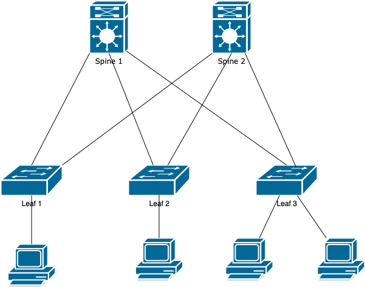

# Домашнее задание 1
## Проектирование адресного пространства

### IP plan
#### Маски:
* p2p - /31
* loopback - /32
#### IP = 10.Dn.Sn.X/31, где:
* Dn – номер ЦОДа,
* Sn – 1-100 spine, 101-255 leaf
* X – 1 для loopback, для p2p по порядку
#### Dn для DC1 = 0 – 7, где 
* 0 - reserved
* 1 – loopback1
* 2 – loopback2
* 3 – p2p links
* 4-7 – services
### Адресация
#### Spine 1
* 10.1.1.1/32 loopback1
* 10.2.1.1/32 loopback2
* 10.3.1.0/31 p2p leaf1
* 10.3.1.2/31 p2p leaf2
* 10.3.1.4/31 p2p leaf3
#### Spine 2
* 10.1.2.1/32 loopback1
* 10.2.2.1/32 loopback2
* 10.3.2.0/31 p2p leaf1
* 10.3.2.2/31 p2p leaf2
* 10.3.2.4/31 p2p leaf3
#### Spine 3
* 10.1.3.1/32 loopback1
* 10.2.3.1/32 loopback2
* 10.3.3.0/31 p2p leaf4
#### Leaf 1
* 10.1.101.1/32 loopback1
* 10.2.101.1/32 loopback2
* 10.3.1.1/31 p2p spine1
* 10.3.2.1/31 p2p spine2
#### Leaf 2
* 10.1.102.1/32 loopback1
* 10.2.102.1/32 loopback2
* 10.3.1.3/31 p2p spine1
* 10.3.2.3/31 p2p spine2
#### Leaf 3
* 10.1.103.1/32 loopback1
* 10.2.103.1/32 loopback2
* 10.3.1.5/31 p2p spine1
* 10.3.2.5/31 p2p spine2
#### Leaf 4
* 10.1.104.1/32 loopback1
* 10.2.104.1/32 loopback2
* 10.3.3.1/31 p2p spine1

10.4.0.0/14 - services
