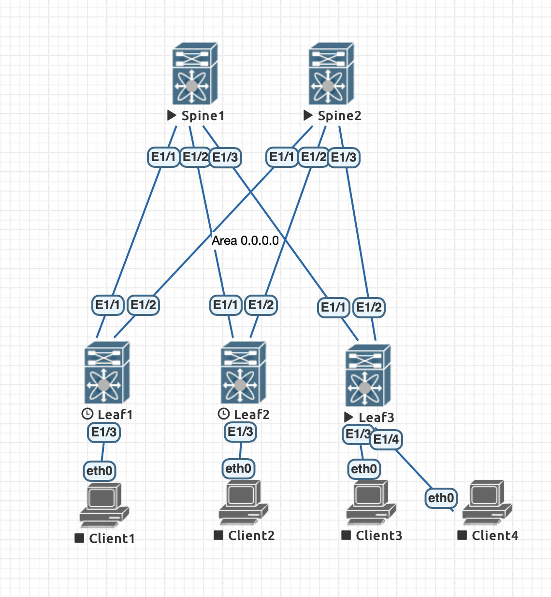

# Лабораторная работа 1
## OSPF underlay

### Конфигурация
#### Spine 1
    feature ospf
    interface Ethernet1/1
      no switchport
      ip address 10.1.1.0/31
      ip ospf network point-to-point
      ip router ospf UNDERLAY area 0.0.0.0
      no shutdown
    interface Ethernet1/2
      no switchport
      ip address 10.1.1.2/31
      ip ospf network point-to-point
      ip router ospf UNDERLAY area 0.0.0.0
      no shutdown
    interface Ethernet1/3
      no switchport
      ip address 10.1.1.4/31
      ip ospf network point-to-point
      ip router ospf UNDERLAY area 0.0.0.0
      no shutdown
    interface loopback1
      ip address 10.0.1.1/32
      ip router ospf UNDERLAY area 0.0.0.0
    router ospf UNDERLAY
      router-id 10.0.1.1   
#### Spine 2
    feature ospf
    interface Ethernet1/1
      no switchport
      ip address 10.1.2.0/31
      ip ospf network point-to-point
      ip router ospf UNDERLAY area 0.0.0.0
      no shutdown
    interface Ethernet1/2
      no switchport
      ip address 10.1.2.2/31
      ip ospf network point-to-point
      ip router ospf UNDERLAY area 0.0.0.0
      no shutdown
    interface Ethernet1/3
      no switchport
      ip address 10.1.2.4/31
      ip ospf network point-to-point
      ip router ospf UNDERLAY area 0.0.0.0
      no shutdown
    interface loopback1
      ip address 10.0.2.1/32
      ip router ospf UNDERLAY area 0.0.0.0
    router ospf UNDERLAY
      router-id 10.0.2.1
#### Leaf 1
    feature ospf
    interface Ethernet1/1
      no switchport
      ip address 10.1.1.1/31
      ip ospf network point-to-point
      ip router ospf UNDERLAY area 0.0.0.0
      no shutdown
    interface Ethernet1/2
      no switchport
      ip address 10.1.2.1/31
      ip ospf network point-to-point
      ip router ospf UNDERLAY area 0.0.0.0
      no shutdown
    interface loopback1
      ip address 10.0.101.1/32
      ip router ospf UNDERLAY area 0.0.0.0
    router ospf UNDERLAY
      router-id 10.0.101.1
#### Leaf 2
    feature ospf
    interface Ethernet1/1
      no switchport
      ip address 10.1.1.3/31
      ip ospf network point-to-point
      ip router ospf UNDERLAY area 0.0.0.0
      no shutdown
    interface Ethernet1/2
      no switchport
      ip address 10.1.2.3/31
      ip ospf network point-to-point
      ip router ospf UNDERLAY area 0.0.0.0
      no shutdown
    interface loopback1
      ip address 10.0.102.1/32
      ip router ospf UNDERLAY area 0.0.0.0
    router ospf UNDERLAY
      router-id 10.0.102.1
#### Leaf 3
    feature ospf
    interface Ethernet1/1
      no switchport
      ip address 10.1.1.5/31
      ip ospf network point-to-point
      ip router ospf UNDERLAY area 0.0.0.0
      no shutdown
    interface Ethernet1/2
      no switchport
      ip address 10.1.2.5/31
      ip ospf network point-to-point
      ip router ospf UNDERLAY area 0.0.0.0
      no shutdown
    interface loopback1
      ip address 10.0.103.1/32
      ip router ospf UNDERLAY area 0.0.0.0
    router ospf UNDERLAY
      router-id 10.0.103.1
