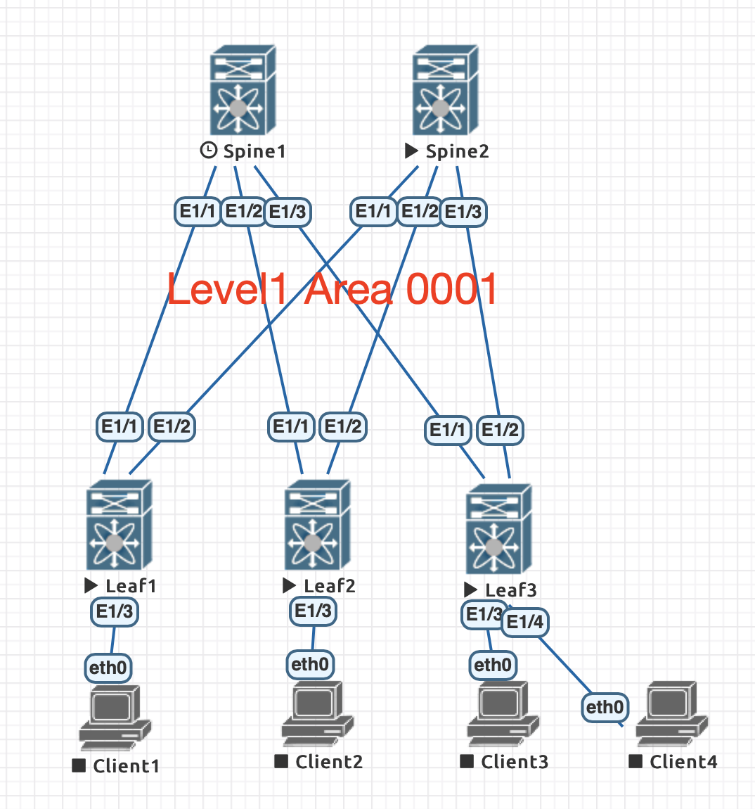

# Лабораторная работа 2
## ISIS underlay

### Схема ISIS
Level2 зарезервирован для superspine bkb связи между цод.
Формат net 49.aaaa.xxxx.yyyy.zzzz.00
* aaaa - Area number
* xxxx - DC number
* yyyy - spine number
* zzzz - leaf number
### Конфигурация
#### Spine 1
    feature isis
    interface Ethernet1/1
      isis circuit-type level-1
      ip router isis underlay
    interface Ethernet1/2
      isis circuit-type level-1
      ip router isis underlay
    interface Ethernet1/3
      isis circuit-type level-1
      ip router isis underlay
    router isis underlay
      net 49.0001.0001.0001.0000.00
      is-type level-1  
#### Spine 2
    feature isis
    interface Ethernet1/1
      isis circuit-type level-1
      ip router isis underlay
    interface Ethernet1/2
      isis circuit-type level-1
      ip router isis underlay
    interface Ethernet1/3
      isis circuit-type level-1
      ip router isis underlay
    router isis underlay
      net 49.0001.0001.0002.0000.00
      is-type level-1 
#### Leaf 1
    feature isis
    interface Ethernet1/1
      isis circuit-type level-1
      ip router isis underlay
    interface Ethernet1/2
      isis circuit-type level-1
      ip router isis underlay
    router isis underlay
      net 49.0001.0001.0000.0001.00
      is-type level-1 
#### Leaf 2
    feature isis
    interface Ethernet1/1
      isis circuit-type level-1
      ip router isis underlay
    interface Ethernet1/2
      isis circuit-type level-1
      ip router isis underlay
    router isis underlay
      net 49.0001.0001.0000.0002.00
      is-type level-1 
#### Leaf 3
    feature isis
    interface Ethernet1/1
      isis circuit-type level-1
      ip router isis underlay
    interface Ethernet1/2
      isis circuit-type level-1
      ip router isis underlay
    router isis underlay
      net 49.0001.0001.0000.0003.00
      is-type level-1 
