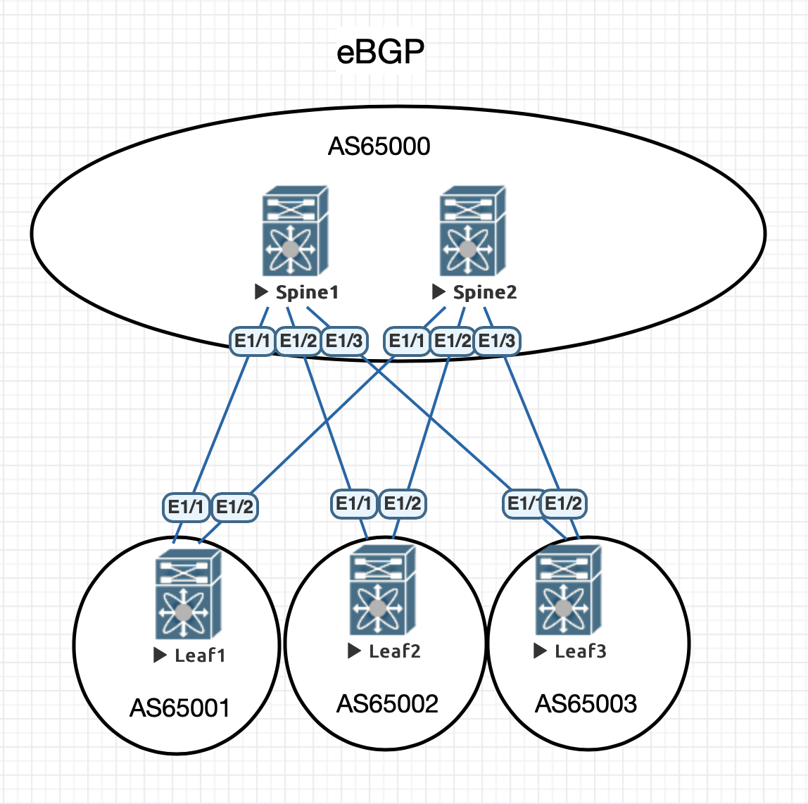

# Лабораторная работа 3
## eBGP underlay

### Схема eBGP
    AS 65000 - Spines 
    AS 65001 - Leaf1 
    AS 65002 - Leaf2 
    AS 65003 - Leaf3
### Конфигурация
#### Spine 1
    router bgp 65000
      router-id 10.0.1.1
      bestpath as-path multipath-relax
      address-family ipv4 unicast
        maximum-paths 64
      neighbor 10.1.1.1
        remote-as 65001
        timers 3 9
        address-family ipv4 unicast
      neighbor 10.1.1.3
        remote-as 65002
        timers 3 9
        address-family ipv4 unicast
      neighbor 10.1.1.5
        remote-as 65003
        timers 3 9
        address-family ipv4 unicast
#### Spine 2
    feature bgp
    router bgp 65000
      router-id 10.0.2.1
      bestpath as-path multipath-relax
      address-family ipv4 unicast
        maximum-paths 64
      neighbor 10.1.2.1
        remote-as 65001
        timers 3 9
        address-family ipv4 unicast
      neighbor 10.1.2.3
        remote-as 65002
        timers 3 9
        address-family ipv4 unicast
      neighbor 10.1.2.5
        remote-as 65003
        timers 3 9
        address-family ipv4 unicast
#### Leaf 1
    feature bgp
    router bgp 65001
      router-id 10.0.101.1
      bestpath as-path multipath-relax
      reconnect-interval 12
      address-family ipv4 unicast
        redistribute direct route-map REDISTRIBUTE_CONNECTED
        maximum-paths 64
      template peer Spines
        remote-as 65000
        timers 3 9
        address-family ipv4 unicast
      neighbor 10.1.1.0
        inherit peer Spines
      neighbor 10.1.2.0
        inherit peer Spines
#### Leaf 2
    feature bgp
    router bgp 65002
      router-id 10.0.102.1
      bestpath as-path multipath-relax
      reconnect-interval 12
      address-family ipv4 unicast
        redistribute direct route-map REDISTRIBUTE_CONNECTED
        maximum-paths 64
      template peer Spines
        remote-as 65000
        timers 3 9
        address-family ipv4 unicast
      neighbor 10.1.1.2
        inherit peer Spines
      neighbor 10.1.2.2
        inherit peer Spines
#### Leaf 3
    feature bgp
    router bgp 65003
      router-id 10.0.103.1
      bestpath as-path multipath-relax
      reconnect-interval 12
      address-family ipv4 unicast
        redistribute direct route-map REDISTRIBUTE_CONNECTED
        maximum-paths 64
      template peer Spines
        remote-as 65000
        timers 3 9
        address-family ipv4 unicast
      neighbor 10.1.1.4
        inherit peer Spines
      neighbor 10.1.2.4
        inherit peer Spines
