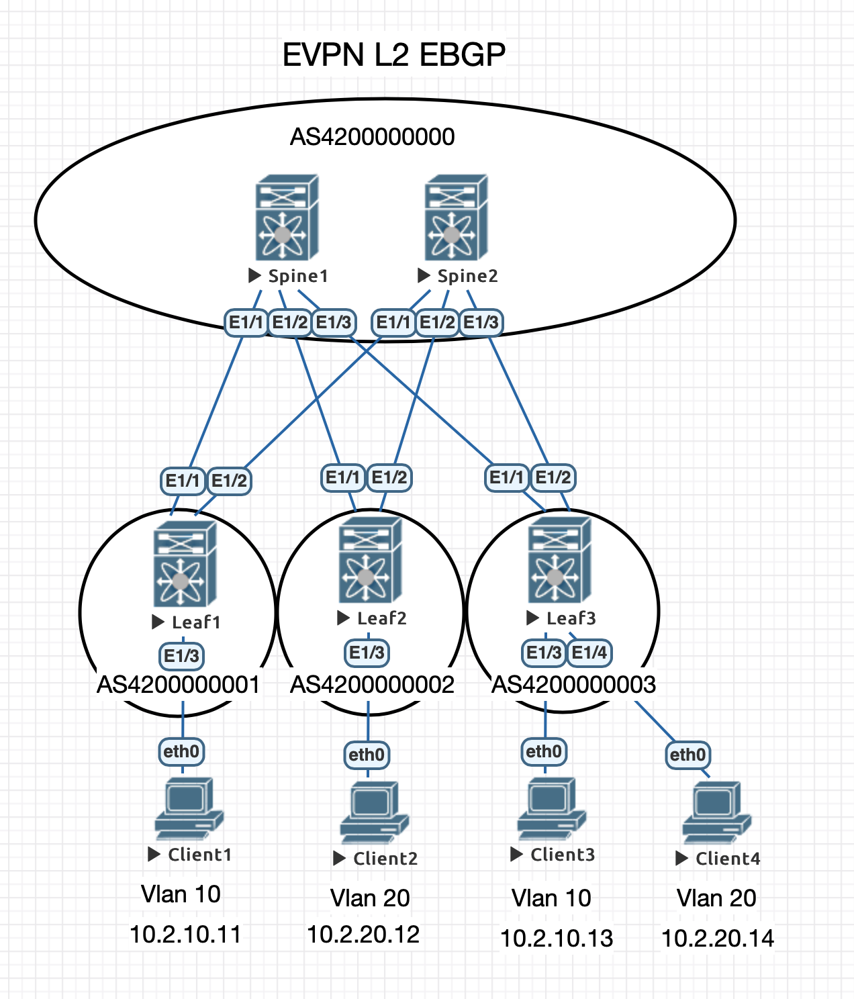

# Лабораторная работа 3
## eBGP underlay

### Схема eBGP для underlay и overlay
    AS 4200000000 - Spines
    AS 4200000001 - Leaf1
    AS 4200000002 - Leaf2
    AS 4200000003 - Leaf3
### Конфигурация
#### Spine 1
    router bgp 4200000000
      router-id 10.0.1.1
      address-family ipv4 unicast
        redistribute direct route-map LOOPBACK
      template peer ULEAFS
        address-family ipv4 unicast
          allowas-in 3
          disable-peer-as-check
      neighbor 10.1.1.1
        inherit peer ULEAFS
        remote-as 4200000001
        update-source Ethernet1/1
      neighbor 10.1.1.3
        inherit peer ULEAFS
        remote-as 4200000002
        update-source Ethernet1/2
      neighbor 10.1.1.5
        inherit peer ULEAFS
        remote-as 4200000003
        update-source Ethernet1/3
#### Spine 2
    router bgp 4200000000
      router-id 10.0.2.1
      address-family ipv4 unicast
        redistribute direct route-map LOOPBACK
      template peer ULEAFS
        address-family ipv4 unicast
          allowas-in 3
          disable-peer-as-check
      neighbor 10.1.2.1
        inherit peer ULEAFS
        remote-as 4200000001
        update-source Ethernet1/1
      neighbor 10.1.2.3
        inherit peer ULEAFS
        remote-as 4200000002
        update-source Ethernet1/2
      neighbor 10.1.2.5
        inherit peer ULEAFS
        remote-as 4200000003
        update-source Ethernet1/3
#### Leaf 1
    router bgp 4200000001
      router-id 10.0.101.1
      address-family ipv4 unicast
        redistribute direct route-map LOOPBACK
      template peer USPINE
        remote-as 4200000000
        address-family ipv4 unicast
          allowas-in 3
          disable-peer-as-check
      neighbor 10.1.1.0
        inherit peer USPINE
        update-source Ethernet1/1
      neighbor 10.1.2.0
        inherit peer USPINE
        update-source Ethernet1/2  
#### Leaf 2
    router bgp 4200000002
      router-id 10.0.102.1
      address-family ipv4 unicast
        redistribute direct route-map LOOPBACK
      template peer USPINE
        remote-as 4200000000
        address-family ipv4 unicast
          allowas-in 3
          disable-peer-as-check
      neighbor 10.1.1.2
        inherit peer USPINE
        update-source Ethernet1/1
      neighbor 10.1.2.2
        inherit peer USPINE
        update-source Ethernet1/2
#### Leaf 3
    router bgp 4200000003
      router-id 10.0.103.1
      address-family ipv4 unicast
        redistribute direct route-map LOOPBACK
      template peer USPINE
        remote-as 4200000000
        address-family ipv4 unicast
          allowas-in 3
          disable-peer-as-check
      neighbor 10.1.1.4
        inherit peer USPINE
        update-source Ethernet1/1
      neighbor 10.1.2.4
        inherit peer USPINE
        update-source Ethernet1/2  
#### Проверка Spine
    Spine1# show ip bgp
    BGP routing table information for VRF default, address family IPv4 Unicast
    BGP table version is 150, Local Router ID is 10.0.1.1
    Status: s-suppressed, x-deleted, S-stale, d-dampened, h-history, *-valid, >-best
    Path type: i-internal, e-external, c-confed, l-local, a-aggregate, r-redist, I-i
    njected
    Origin codes: i - IGP, e - EGP, ? - incomplete, | - multipath, & - backup, 2 - b
    est2

       Network            Next Hop            Metric     LocPrf     Weight Path
    *>e10.0.0.1/32        10.1.1.1                 0                     0 420000000
    1 ?
    * e                   10.1.1.3                 0                     0 420000000
    2 ?
    *>r10.0.1.1/32        0.0.0.0                  0        100      32768 ?
    *>r10.0.1.2/32        0.0.0.0                  0        100      32768 ?
    *>e10.0.2.1/32        10.1.1.5                                       0 420000000
    3 4200000000 ?
    * e                   10.1.1.1                                       0 420000000
    1 4200000000 ?
    * e                   10.1.1.3                                       0 420000000
    2 4200000000 ?
    *>e10.0.101.1/32      10.1.1.1                 0                     0 420000000
    1 ?
    *>e10.0.101.2/32      10.1.1.1                 0                     0 420000000
    1 ?
    *>e10.0.102.1/32      10.1.1.3                 0                     0 420000000
    2 ?
    *>e10.0.102.2/32      10.1.1.3                 0                     0 420000000
    2 ?
    *>e10.0.103.1/32      10.1.1.5                 0                     0 420000000
    3 ?
    *>e10.0.103.2/32      10.1.1.5                 0                     0 420000000
    3 ?
#### Проверка Leaf
    Leaf3# show ip bgp
    BGP routing table information for VRF default, address family IPv4 Unicast
    BGP table version is 108, Local Router ID is 10.0.103.1
    Status: s-suppressed, x-deleted, S-stale, d-dampened, h-history, *-valid, >-best
    Path type: i-internal, e-external, c-confed, l-local, a-aggregate, r-redist, I-i
    njected
    Origin codes: i - IGP, e - EGP, ? - incomplete, | - multipath, & - backup, 2 - b
    est2

       Network            Next Hop            Metric     LocPrf     Weight Path
    *>e10.0.0.1/32        10.1.1.4                                       0 420000000
    0 4200000001 ?
    * e                   10.1.2.4                                       0 420000000
    0 4200000001 ?
    *>e10.0.1.1/32        10.1.1.4                 0                     0 420000000
    0 ?
    * e10.0.1.2/32        10.1.2.4                 0                     0 420000000
    0 ?
    *>e                   10.1.1.4                 0                     0 420000000
    0 ?
    *>e10.0.2.1/32        10.1.2.4                 0                     0 420000000
    0 ?
    * e10.0.101.1/32      10.1.2.4                                       0 420000000
    0 4200000001 ?
    *>e                   10.1.1.4                                       0 420000000
    0 4200000001 ?
    * e10.0.101.2/32      10.1.2.4                                       0 420000000
    0 4200000001 ?
    *>e                   10.1.1.4                                       0 420000000
    0 4200000001 ?
    * e10.0.102.1/32      10.1.2.4                                       0 420000000
    0 4200000002 ?
    *>e                   10.1.1.4                                       0 420000000
    0 4200000002 ?
    * e10.0.102.2/32      10.1.2.4                                       0 420000000
    0 4200000002 ?
    *>e                   10.1.1.4                                       0 420000000
    0 4200000002 ?
    *>r10.0.103.1/32      0.0.0.0                  0        100      32768 ?
    *>r10.0.103.2/32      0.0.0.0                  0        100      32768 ?
