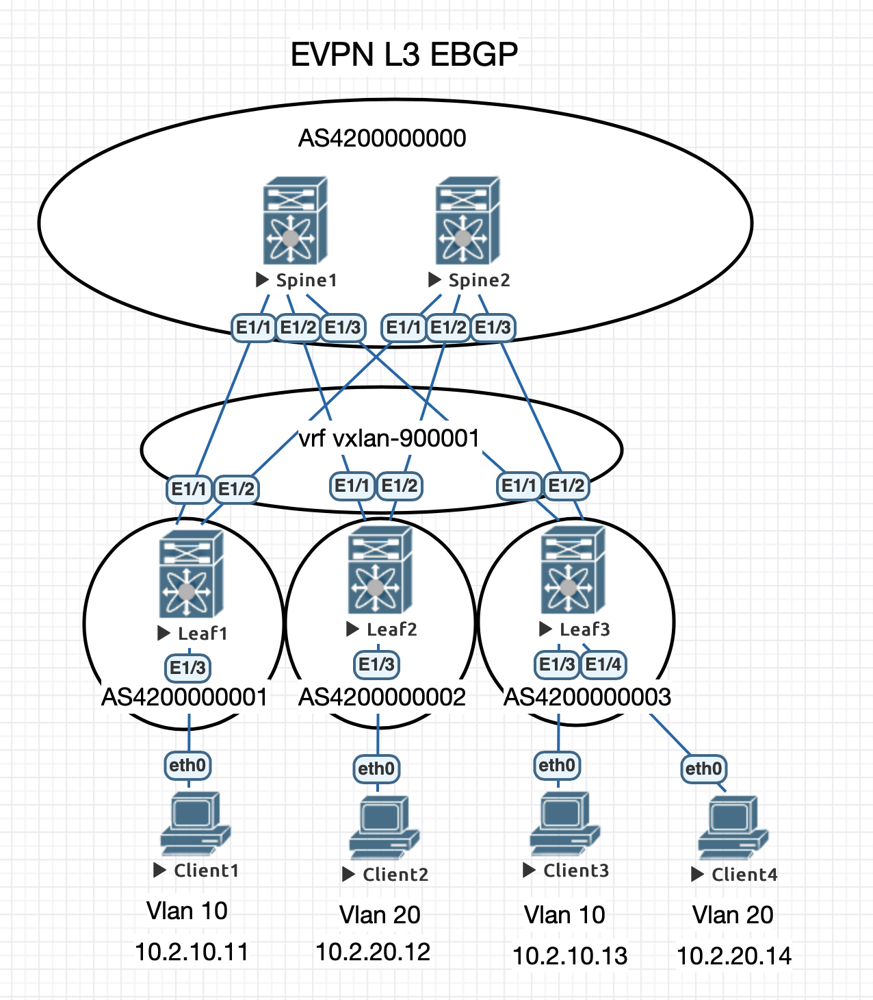

# Лабораторная работа 5
## Overlay на основе VxLAN EVPN для L3 связанности между клиентами

### Схема eBGP для underlay и overlay
    AS 4200000000 - Spines
    AS 4200000001 - Leaf1
    AS 4200000002 - Leaf2
    AS 4200000003 - Leaf3
### Нумерация VNI
    1xxxx  - где xxxx - номер Vlan
    900001 - vrf для L3 связанности
### Конфигурация
#### Spine 1
    router bgp 4200000000
      router-id 10.0.1.1
      address-family ipv4 unicast
        redistribute direct route-map LOOPBACK
      address-family l2vpn evpn
        nexthop route-map NEXT-HOP-UNCH
        retain route-target all
      template peer OLEAFS
        update-source loopback1
        ebgp-multihop 3
        address-family l2vpn evpn
          disable-peer-as-check
          send-community
          send-community extended
          route-map NEXT-HOP-UNCH out
      template peer ULEAFS
        address-family ipv4 unicast
          allowas-in 3
          disable-peer-as-check
      neighbor 10.0.101.1
        inherit peer OLEAFS
        remote-as 4200000001
      neighbor 10.0.102.1
        inherit peer OLEAFS
        remote-as 4200000002
      neighbor 10.0.103.1
        inherit peer OLEAFS
        remote-as 4200000003
      neighbor 10.1.1.1
        inherit peer ULEAFS
        remote-as 4200000001
        update-source Ethernet1/1
      neighbor 10.1.1.3
        inherit peer ULEAFS
        remote-as 4200000002
        update-source Ethernet1/2
      neighbor 10.1.1.5
        inherit peer ULEAFS
        remote-as 4200000003
        update-source Ethernet1/3
#### Spine 2
    router bgp 4200000000
      router-id 10.0.2.1
      address-family ipv4 unicast
        redistribute direct route-map LOOPBACK
      address-family l2vpn evpn
        nexthop route-map NEXT-HOP-UNCH
        retain route-target all
      template peer OLEAFS
        update-source loopback1
        ebgp-multihop 3
        address-family l2vpn evpn
          disable-peer-as-check
          send-community
          send-community extended
          route-map NEXT-HOP-UNCH out
      template peer ULEAFS
        address-family ipv4 unicast
          allowas-in 3
          disable-peer-as-check
      neighbor 10.0.101.1
        inherit peer OLEAFS
        remote-as 4200000001
      neighbor 10.0.102.1
        inherit peer OLEAFS
        remote-as 4200000002
      neighbor 10.0.103.1
        inherit peer OLEAFS
        remote-as 4200000003
      neighbor 10.1.2.1
        inherit peer ULEAFS
        remote-as 4200000001
        update-source Ethernet1/1
      neighbor 10.1.2.3
        inherit peer ULEAFS
        remote-as 4200000002
        update-source Ethernet1/2
      neighbor 10.1.2.5
        inherit peer ULEAFS
        remote-as 4200000003
        update-source Ethernet1/3
 #### Leaf 1
    nv overlay evpn
    feature bgp
    feature fabric forwarding
    feature interface-vlan
    feature vn-segment-vlan-based
    feature nv overlay
    fabric forwarding anycast-gateway-mac 0000.2222.3333
    
    vlan 10
      vn-segment 10010 
    vlan 101
      vn-segment 900001
      
    route-map HOST-SVI permit 10
      match interface Vlan10 
    route-map LOOPBACK permit 10
      match interface loopback1 loopback2 
    route-map NEXT-HOP-UNCH permit 10
      set ip next-hop unchanged

    vrf context vxlan-900001
      vni 900001
      rd auto
      
    interface Vlan10
      no shutdown
      vrf member vxlan-900001
      ip address 10.2.10.1/24
      fabric forwarding mode anycast-gateway
      
    interface Vlan101
      no shutdown
      vrf member vxlan-900001
      no ip redirects
      ip forward
      ipv6 address use-link-local-only
      no ipv6 redirects
      
    interface nve1
      no shutdown
      host-reachability protocol bgp
      source-interface loopback2
      member vni 10010
      member vni 900001 associate-vrf
      
    router bgp 4200000001
      router-id 10.0.101.1
      address-family ipv4 unicast
        redistribute direct route-map LOOPBACK
      template peer OSPINE
        remote-as 4200000000
        update-source loopback1
        ebgp-multihop 3
        address-family l2vpn evpn
          disable-peer-as-check
          send-community
          send-community extended
          route-map NEXT-HOP-UNCH out
      template peer USPINE
        remote-as 4200000000
        address-family ipv4 unicast
          allowas-in 3
          disable-peer-as-check
      neighbor 10.0.1.1
        inherit peer OSPINE
      neighbor 10.0.2.1
        inherit peer OSPINE
      neighbor 10.1.1.0
        inherit peer USPINE
        update-source Ethernet1/1
      neighbor 10.1.2.0
        inherit peer USPINE
        update-source Ethernet1/2
      vrf vxlan-900001
        address-family ipv4 unicast
          redistribute direct route-map HOST-SVI
 #### Leaf 2
    nv overlay evpn
    feature bgp
    feature fabric forwarding
    feature interface-vlan
    feature vn-segment-vlan-based
    feature nv overlay
    fabric forwarding anycast-gateway-mac 0000.2222.3333
    
    vlan 20
      vn-segment 10020
    vlan 101
      vn-segment 900001
      
    route-map HOST-SVI permit 10
      match interface Vlan20
    route-map LOOPBACK permit 10
      match interface loopback1 loopback2
    route-map NEXT-HOP-UNCH permit 10
      set ip next-hop unchanged
      
    vrf context vxlan-900001
      vni 900001
      rd auto
      
    interface Vlan20
      no shutdown
      vrf member vxlan-900001
      ip address 10.2.20.1/24
      fabric forwarding mode anycast-gateway
      
    interface Vlan101
      no shutdown
      vrf member vxlan-900001
      no ip redirects
      ip forward
      ipv6 address use-link-local-only
      no ipv6 redirects
      
    interface nve1
      no shutdown
      host-reachability protocol bgp
      source-interface loopback2
      member vni 10020
      member vni 900001 associate-vrf
      
    router bgp 4200000002
      router-id 10.0.102.1
      address-family ipv4 unicast
        redistribute direct route-map LOOPBACK
      address-family l2vpn evpn
        nexthop route-map NEXT-HOP-UNCH
        retain route-target all
      template peer OSPINE
        remote-as 4200000000
        update-source loopback1
        ebgp-multihop 3
        address-family l2vpn evpn
          disable-peer-as-check
          send-community
          send-community extended
          route-map NEXT-HOP-UNCH out
      template peer USPINE
        remote-as 4200000000
        address-family ipv4 unicast
          allowas-in 3
          disable-peer-as-check
      neighbor 10.0.1.1
        inherit peer OSPINE
      neighbor 10.0.2.1
        inherit peer OSPINE
      neighbor 10.1.1.2
        inherit peer USPINE
        update-source Ethernet1/1
      neighbor 10.1.2.2
        inherit peer USPINE
        update-source Ethernet1/2
      vrf vxlan-900001
        address-family ipv4 unicast
          redistribute direct route-map HOST-SVI
 #### Leaf 3
    nv overlay evpn
    feature bgp
    feature fabric forwarding
    feature interface-vlan
    feature vn-segment-vlan-based
    feature nv overlay
    fabric forwarding anycast-gateway-mac 0000.2222.3333
    
    vlan 10
      vn-segment 10010
    vlan 20
      vn-segment 10020
    vlan 101
      vn-segment 900001

    route-map HOST-SVI permit 10
      match interface Vlan10 Vlan20
    route-map LOOPBACK permit 10
      match interface loopback1 loopback2
    route-map NEXT-HOP-UNCH permit 10
      set ip next-hop unchanged

    vrf context vxlan-900001
      vni 900001
      rd auto

    interface Vlan10
      no shutdown
      vrf member vxlan-900001
      ip address 10.2.10.1/24
      fabric forwarding mode anycast-gateway

    interface Vlan20
      no shutdown
      vrf member vxlan-900001
      ip address 10.2.20.1/24
      fabric forwarding mode anycast-gateway

    interface Vlan101
      no shutdown
      vrf member vxlan-900001
      no ip redirects
      ip forward
      ipv6 address use-link-local-only
      no ipv6 redirects
      
    interface nve1
      no shutdown
      host-reachability protocol bgp
      source-interface loopback2
      member vni 10010
      member vni 10020
      member vni 900001 associate-vrf
      
    router bgp 4200000003
      router-id 10.0.103.1
      address-family ipv4 unicast
        redistribute direct route-map LOOPBACK
      address-family l2vpn evpn
        nexthop route-map NEXT-HOP-UNCH
        retain route-target all
      template peer OSPINE
        remote-as 4200000000
        update-source loopback1
        ebgp-multihop 3
        address-family l2vpn evpn
          disable-peer-as-check
          send-community
          send-community extended
          route-map NEXT-HOP-UNCH out
      template peer USPINE
        remote-as 4200000000
        address-family ipv4 unicast
          allowas-in 3
          disable-peer-as-check
      neighbor 10.0.1.1
        inherit peer OSPINE
      neighbor 10.0.2.1
        inherit peer OSPINE
      neighbor 10.1.1.4
        inherit peer USPINE
        update-source Ethernet1/1
      neighbor 10.1.2.4
        inherit peer USPINE
        update-source Ethernet1/2
      vrf vxlan-900001
        address-family ipv4 unicast
          redistribute direct route-map HOST-SVI
