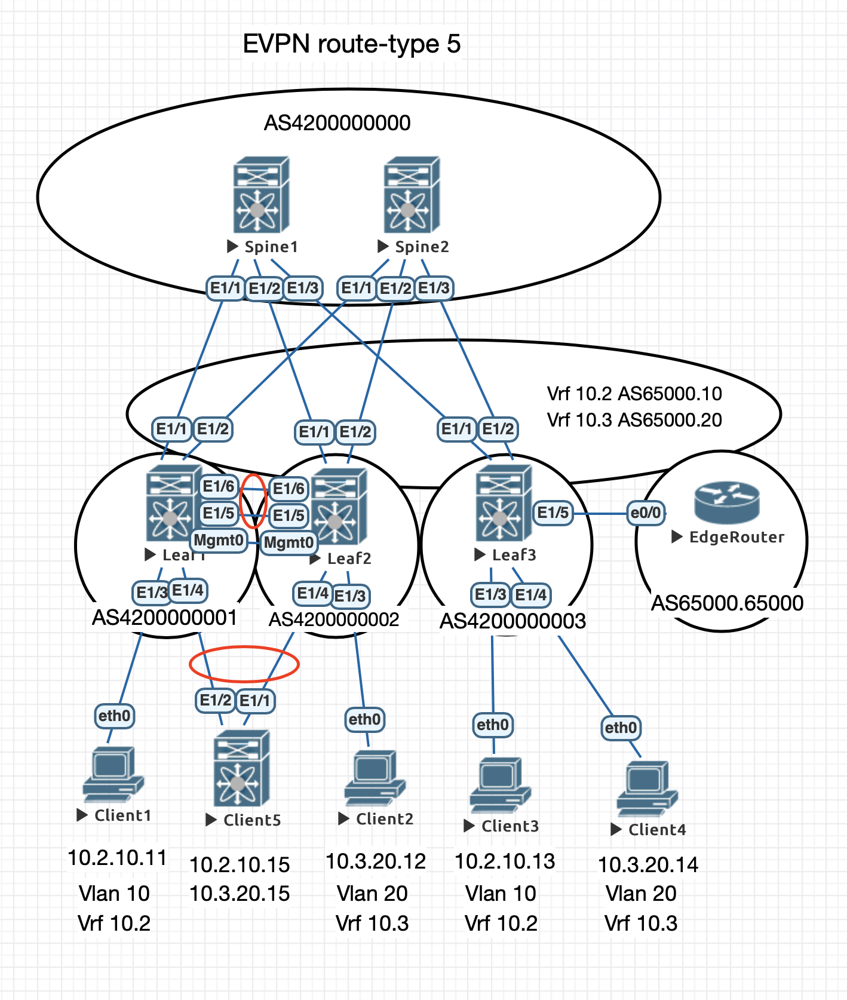

# Лабораторная работа 7
## Реализовать передачу суммарных префиксов через EVPN route-type 5

### Схема eBGP для underlay и overlay
    AS 4200000000 - Spines
    AS 4200000001 - Leaf1
    AS 4200000002 - Leaf2
    AS 4200000003 - Leaf3
### Нумерация VNI
    Yxxxx  - где xxxx - номер Vlan, Y - номер VRF
### IP Адресация
    10.Dn.Sn.X/31, где:
    * Dn – номер ЦОДа,
    * Sn – 0 для vPC secondary ip, 1-100 spine, 101-255 leaf,
    * X – 1-2 для loopback, для p2p по порядку, для vPC secondary ip но номеру домена.
### Конфигурация
#### Spine 1
    router bgp 4200000000
      router-id 10.0.1.1
      address-family ipv4 unicast
        redistribute direct route-map LOOPBACK
      address-family l2vpn evpn
        nexthop route-map NEXT-HOP-UNCH
        retain route-target all
      template peer OLEAFS
        update-source loopback1
        ebgp-multihop 3
        address-family l2vpn evpn
          send-community
          send-community extended
          route-map NEXT-HOP-UNCH out
      template peer ULEAFS
        address-family ipv4 unicast
      neighbor 10.0.101.1
        inherit peer OLEAFS
        remote-as 4200000001
      neighbor 10.0.102.1
        inherit peer OLEAFS
        remote-as 4200000002
      neighbor 10.0.103.1
        inherit peer OLEAFS
        remote-as 4200000003
      neighbor 10.1.1.1
        inherit peer ULEAFS
        remote-as 4200000001
        update-source Ethernet1/1
      neighbor 10.1.1.3
        inherit peer ULEAFS
        remote-as 4200000002
        update-source Ethernet1/2
      neighbor 10.1.1.5
        inherit peer ULEAFS
        remote-as 4200000003
        update-source Ethernet1/3
#### Spine 2
    router bgp 4200000000
      router-id 10.0.2.1
      address-family ipv4 unicast
        redistribute direct route-map LOOPBACK
      address-family l2vpn evpn
        nexthop route-map NEXT-HOP-UNCH
        retain route-target all
      template peer OLEAFS
        update-source loopback1
        ebgp-multihop 3
        address-family l2vpn evpn
          send-community
          send-community extended
          route-map NEXT-HOP-UNCH out
      template peer ULEAFS
        address-family ipv4 unicast
      neighbor 10.0.101.1
        inherit peer OLEAFS
        remote-as 4200000001
      neighbor 10.0.102.1
        inherit peer OLEAFS
        remote-as 4200000002
      neighbor 10.0.103.1
        inherit peer OLEAFS
        remote-as 4200000003
      neighbor 10.1.2.1
        inherit peer ULEAFS
        remote-as 4200000001
        update-source Ethernet1/1
      neighbor 10.1.2.3
        inherit peer ULEAFS
        remote-as 4200000002
        update-source Ethernet1/2
      neighbor 10.1.2.5
        inherit peer ULEAFS
        remote-as 4200000003
        update-source Ethernet1/3
 #### Leaf 1
    nv overlay evpn
    feature bgp
    feature fabric forwarding
    feature interface-vlan
    feature vn-segment-vlan-based
    feature vpc
    feature nv overlay
    fabric forwarding anycast-gateway-mac 0000.2222.3333
    
    vlan 10
      vn-segment 20010
    vlan 20
      vn-segment 30020
    vlan 210
      vn-segment 20210
    vlan 320
      vn-segment 30320
      
    vrf context 10.2
      vni 20210
      rd auto
      address-family ipv4 unicast
        route-target both auto
        route-target both auto evpn
    vrf context 10.3
      vni 30320
      rd auto
      address-family ipv4 unicast
        route-target both auto
        route-target both auto evpn    
    
    interface Vlan10
      no shutdown
      vrf member 10.2
      no ip redirects
      ip address 10.2.10.1/24
      no ipv6 redirects
      fabric forwarding mode anycast-gateway

    interface Vlan20
      no shutdown
      vrf member 10.3
      no ip redirects
      ip address 10.3.20.1/24
      no ipv6 redirects
      fabric forwarding mode anycast-gateway

    interface Vlan210
      no shutdown
      vrf member 10.2
      no ip redirects
      ip forward
      no ipv6 redirects

    interface Vlan320
      no shutdown
      vrf member 10.3
      no ip redirects
      ip forward
      no ipv6 redirects
      
    interface nve1
      no shutdown
      host-reachability protocol bgp
      source-interface loopback2
      global mcast-group 239.0.0.1 L2
      member vni 20010
      member vni 20210 associate-vrf
      member vni 30020
      member vni 30320 associate-vrf
      
    router bgp 4200000001
      router-id 10.0.101.1
      address-family ipv4 unicast
        redistribute direct route-map LOOPBACK
      template peer OSPINE
        remote-as 4200000000
        update-source loopback1
        ebgp-multihop 3
        address-family l2vpn evpn
          send-community
          send-community extended
          route-map NEXT-HOP-UNCH out
      template peer USPINE
        remote-as 4200000000
        address-family ipv4 unicast
      neighbor 10.0.1.1
        inherit peer OSPINE
      neighbor 10.0.2.1
        inherit peer OSPINE
      neighbor 10.1.1.0
        inherit peer USPINE
        update-source Ethernet1/1
      neighbor 10.1.2.0
        inherit peer USPINE
        update-source Ethernet1/2
      vrf 10.2
        address-family ipv4 unicast
      vrf 10.3
        address-family ipv4 unicast
 #### Leaf 2
    nv overlay evpn
    feature bgp
    feature fabric forwarding
    feature interface-vlan
    feature vn-segment-vlan-based
    feature vpc
    feature nv overlay
    fabric forwarding anycast-gateway-mac 0000.2222.3333
    
    vlan 10
      vn-segment 10010    
    vlan 20
      vn-segment 10020
    vlan 101
      vn-segment 900001
      
    route-map HOST-SVI permit 10
      match interface Vlan10 Vlan20
    route-map LOOPBACK permit 10
      match interface loopback1 loopback2
    route-map NEXT-HOP-UNCH permit 10
      set ip next-hop unchanged
      
    vrf context vxlan-900001
      vni 900001
      rd auto
      
    vpc domain 1
      peer-switch
      peer-keepalive destination 10.0.0.1 source 10.0.0.2
      peer-gateway
      auto-recovery
      ip arp synchronize    
      
    interface Vlan10
      no shutdown
      vrf member vxlan-900001
      no ip redirects
      ip address 10.2.10.1/24
      no ipv6 redirects
      fabric forwarding mode anycast-gateway

    interface Vlan20
      no shutdown
      vrf member vxlan-900001
      no ip redirects
      ip address 10.2.20.1/24
      no ipv6 redirects
      fabric forwarding mode anycast-gateway
      
    interface Vlan101
      no shutdown
      vrf member vxlan-900001
      no ip redirects
      ip forward
      ipv6 address use-link-local-only
      no ipv6 redirects
      
    interface port-channel1
      switchport mode trunk
      spanning-tree port type network
      vpc peer-link

    interface port-channel4
      switchport mode trunk
      vpc 4      
  
    interface nve1
      no shutdown
      host-reachability protocol bgp
      source-interface loopback2
      member vni 10010
      member vni 10020
      member vni 900001 associate-vrf
      
    interface mgmt0
      vrf member management
      ip address 10.0.0.2/30

    interface loopback1
      ip address 10.0.102.1/32

    interface loopback2
      ip address 10.0.102.2/32
      ip address 10.0.0.1/32 secondary    
  
    router bgp 4200000002
      router-id 10.0.102.1
      address-family ipv4 unicast
        redistribute direct route-map LOOPBACK
      address-family l2vpn evpn
        nexthop route-map NEXT-HOP-UNCH
        retain route-target all
      template peer OSPINE
        remote-as 4200000000
        update-source loopback1
        ebgp-multihop 3
        address-family l2vpn evpn
          disable-peer-as-check
          send-community
          send-community extended
          route-map NEXT-HOP-UNCH out
      template peer USPINE
        remote-as 4200000000
        address-family ipv4 unicast
          allowas-in 3
          disable-peer-as-check
      neighbor 10.0.1.1
        inherit peer OSPINE
      neighbor 10.0.2.1
        inherit peer OSPINE
      neighbor 10.1.1.2
        inherit peer USPINE
        update-source Ethernet1/1
      neighbor 10.1.2.2
        inherit peer USPINE
        update-source Ethernet1/2
      vrf vxlan-900001
        address-family ipv4 unicast
          redistribute direct route-map HOST-SVI
 #### Leaf 3
    nv overlay evpn
    feature bgp
    feature fabric forwarding
    feature interface-vlan
    feature vn-segment-vlan-based
    feature nv overlay
    fabric forwarding anycast-gateway-mac 0000.2222.3333
    
    vlan 10
      vn-segment 10010
    vlan 20
      vn-segment 10020
    vlan 101
      vn-segment 900001

    route-map HOST-SVI permit 10
      match interface Vlan10 Vlan20
    route-map LOOPBACK permit 10
      match interface loopback1 loopback2
    route-map NEXT-HOP-UNCH permit 10
      set ip next-hop unchanged

    vrf context vxlan-900001
      vni 900001
      rd auto

    interface Vlan10
      no shutdown
      vrf member vxlan-900001
      ip address 10.2.10.1/24
      fabric forwarding mode anycast-gateway

    interface Vlan20
      no shutdown
      vrf member vxlan-900001
      ip address 10.2.20.1/24
      fabric forwarding mode anycast-gateway

    interface Vlan101
      no shutdown
      vrf member vxlan-900001
      no ip redirects
      ip forward
      ipv6 address use-link-local-only
      no ipv6 redirects
      
    interface nve1
      no shutdown
      host-reachability protocol bgp
      source-interface loopback2
      member vni 10010
      member vni 10020
      member vni 900001 associate-vrf
      
    router bgp 4200000003
      router-id 10.0.103.1
      address-family ipv4 unicast
        redistribute direct route-map LOOPBACK
      address-family l2vpn evpn
        nexthop route-map NEXT-HOP-UNCH
        retain route-target all
      template peer OSPINE
        remote-as 4200000000
        update-source loopback1
        ebgp-multihop 3
        address-family l2vpn evpn
          disable-peer-as-check
          send-community
          send-community extended
          route-map NEXT-HOP-UNCH out
      template peer USPINE
        remote-as 4200000000
        address-family ipv4 unicast
          allowas-in 3
          disable-peer-as-check
      neighbor 10.0.1.1
        inherit peer OSPINE
      neighbor 10.0.2.1
        inherit peer OSPINE
      neighbor 10.1.1.4
        inherit peer USPINE
        update-source Ethernet1/1
      neighbor 10.1.2.4
        inherit peer USPINE
        update-source Ethernet1/2
      vrf vxlan-900001
        address-family ipv4 unicast
          redistribute direct route-map HOST-SVI
#### Client 5
    ip route 0.0.0.0/0 10.2.10.1

    vrf context Vlan20
      ip route 0.0.0.0/0 10.2.20.1

    interface Vlan10
      no shutdown
      ip address 10.2.10.15/24

    interface Vlan20
      no shutdown
      vrf member Vlan20
      ip address 10.2.20.15/24

    interface port-channel1
      switchport mode trunk

    interface Ethernet1/1
      switchport mode trunk
      channel-group 1

    interface Ethernet1/2
      switchport mode trunk
      channel-group 1 
#### Проверка vPC
    Leaf1# show vpc
    Legend:
                    (*) - local vPC is down, forwarding via vPC peer-link

    vPC domain id                     : 1
    Peer status                       : peer adjacency formed ok
    vPC keep-alive status             : peer is alive
    Configuration consistency status  : success
    Per-vlan consistency status       : success
    Type-2 consistency status         : success
    vPC role                          : primary
    Number of vPCs configured         : 1
    Peer Gateway                      : Enabled
    Dual-active excluded VLANs        : -
    Graceful Consistency Check        : Enabled
    Auto-recovery status              : Enabled, timer is off.(timeout = 240s)
    Delay-restore status              : Timer is off.(timeout = 30s)
    Delay-restore SVI status          : Timer is off.(timeout = 10s)
    Operational Layer3 Peer-router    : Disabled
    Virtual-peerlink mode             : Disabled

    vPC Peer-link status
    ---------------------------------------------------------------------
    id    Port   Status Active vlans
    --    ----   ------ -------------------------------------------------
    1     Po1    up     1,10,20,101

    vPC status
    ----------------------------------------------------------------------------
    Id    Port          Status Consistency Reason                Active vlans
    --    ------------  ------ ----------- ------                ---------------
    4     Po4           up     success     success               1,10,20,101

    Please check "show vpc consistency-parameters vpc <vpc-num>" for the
    consistency reason of down vpc and for type-2 consistency reasons for
    any vpc.
#### Проверка доступности
    Leaf3# show bgp l2vpn evpn
    BGP routing table information for VRF default, address family L2VPN EVPN
    BGP table version is 1200, Local Router ID is 10.0.103.1
    Status: s-suppressed, x-deleted, S-stale, d-dampened, h-history, *-valid, >-best
    Path type: i-internal, e-external, c-confed, l-local, a-aggregate, r-redist, I-i
    njected
    Origin codes: i - IGP, e - EGP, ? - incomplete, | - multipath, & - backup, 2 - b
    est2

       Network            Next Hop            Metric     LocPrf     Weight Path
    Route Distinguisher: 10.0.101.1:3
    *>e[5]:[0]:[0]:[24]:[10.2.10.0]/224
                          10.0.0.1                                       0 420000000
    0 4200000001 ?
    * e                   10.0.0.1                                       0 420000000
    0 4200000001 ?
    *>e[5]:[0]:[0]:[24]:[10.2.20.0]/224
                          10.0.0.1                                       0 420000000
    0 4200000001 ?
    * e                   10.0.0.1                                       0 420000000
    0 4200000001 ?

    Route Distinguisher: 10.0.101.1:32777
    *>e[2]:[0]:[0]:[48]:[0050.7966.6806]:[0]:[0.0.0.0]/216
                          10.0.0.1                                       0 420000000
    0 4200000001 i
    * e                   10.0.0.1                                       0 420000000
    0 4200000001 i
    * e[2]:[0]:[0]:[48]:[500a.0000.1b08]:[0]:[0.0.0.0]/216
                          10.0.0.1                                       0 420000000
    0 4200000001 i
    *>e                   10.0.0.1                                       0 420000000
    0 4200000001 i
    *>e[2]:[0]:[0]:[48]:[0050.7966.6806]:[32]:[10.2.10.11]/272
                          10.0.0.1                                       0 420000000
    0 4200000001 i
    * e                   10.0.0.1                                       0 420000000
    0 4200000001 i
    * e[2]:[0]:[0]:[48]:[500a.0000.1b08]:[32]:[10.2.10.15]/272
                          10.0.0.1                                       0 420000000
    0 4200000001 i
    *>e                   10.0.0.1                                       0 420000000
    0 4200000001 i

    Route Distinguisher: 10.0.101.1:32787
    *>e[2]:[0]:[0]:[48]:[0050.7966.6807]:[0]:[0.0.0.0]/216
                          10.0.0.1                                       0 420000000
    0 4200000001 i
    * e                   10.0.0.1                                       0 420000000
    0 4200000001 i
    * e[2]:[0]:[0]:[48]:[500a.0000.1b08]:[0]:[0.0.0.0]/216
                          10.0.0.1                                       0 420000000
    0 4200000001 i
    *>e                   10.0.0.1                                       0 420000000
    0 4200000001 i
    * e[2]:[0]:[0]:[48]:[0050.7966.6807]:[32]:[10.2.20.12]/272
                          10.0.0.1                                       0 420000000
    0 4200000001 i
    *>e                   10.0.0.1                                       0 420000000
    0 4200000001 i
    * e[2]:[0]:[0]:[48]:[500a.0000.1b08]:[32]:[10.2.20.15]/272
                          10.0.0.1                                       0 420000000
    0 4200000001 i
    *>e                   10.0.0.1                                       0 420000000
    0 4200000001 i

    Route Distinguisher: 10.0.102.1:3
    * e[5]:[0]:[0]:[24]:[10.2.10.0]/224
                          10.0.0.1                                       0 420000000
    0 4200000002 ?
    *>e                   10.0.0.1                                       0 420000000
    0 4200000002 ?
    * e[5]:[0]:[0]:[24]:[10.2.20.0]/224
                          10.0.0.1                                       0 420000000
    0 4200000002 ?
    *>e                   10.0.0.1                                       0 420000000
    0 4200000002 ?

    Route Distinguisher: 10.0.102.1:32777
    * e[2]:[0]:[0]:[48]:[0050.7966.6806]:[0]:[0.0.0.0]/216
                          10.0.0.1                                       0 420000000
    0 4200000002 i
    *>e                   10.0.0.1                                       0 420000000
    0 4200000002 i
    * e[2]:[0]:[0]:[48]:[500a.0000.1b08]:[0]:[0.0.0.0]/216
                          10.0.0.1                                       0 420000000
    0 4200000002 i
    *>e                   10.0.0.1                                       0 420000000
    0 4200000002 i
    * e[2]:[0]:[0]:[48]:[0050.7966.6806]:[32]:[10.2.10.11]/272
                          10.0.0.1                                       0 420000000
    0 4200000002 i
    *>e                   10.0.0.1                                       0 420000000
    0 4200000002 i
    * e[2]:[0]:[0]:[48]:[500a.0000.1b08]:[32]:[10.2.10.15]/272
                          10.0.0.1                                       0 420000000
    0 4200000002 i
    *>e                   10.0.0.1                                       0 420000000
    0 4200000002 i

    Route Distinguisher: 10.0.102.1:32787
    * e[2]:[0]:[0]:[48]:[0050.7966.6807]:[0]:[0.0.0.0]/216
                          10.0.0.1                                       0 420000000
    0 4200000002 i
    *>e                   10.0.0.1                                       0 420000000
    0 4200000002 i
    * e[2]:[0]:[0]:[48]:[500a.0000.1b08]:[0]:[0.0.0.0]/216
                          10.0.0.1                                       0 420000000
    0 4200000002 i
    *>e                   10.0.0.1                                       0 420000000
    0 4200000002 i
    *>e[2]:[0]:[0]:[48]:[0050.7966.6807]:[32]:[10.2.20.12]/272
                          10.0.0.1                                       0 420000000
    0 4200000002 i
    * e                   10.0.0.1                                       0 420000000
    0 4200000002 i
    * e[2]:[0]:[0]:[48]:[500a.0000.1b08]:[32]:[10.2.20.15]/272
                          10.0.0.1                                       0 420000000
    0 4200000002 i
    *>e                   10.0.0.1                                       0 420000000
    0 4200000002 i

    Route Distinguisher: 10.0.103.1:32777    (L2VNI 10010)
    * e[2]:[0]:[0]:[48]:[0050.7966.6806]:[0]:[0.0.0.0]/216
                          10.0.0.1                                       0 420000000
    0 4200000002 i
    *>e                   10.0.0.1                                       0 420000000
    0 4200000001 i
    *>l[2]:[0]:[0]:[48]:[0050.7966.6808]:[0]:[0.0.0.0]/216
                          10.0.103.2                        100      32768 i
    * e[2]:[0]:[0]:[48]:[500a.0000.1b08]:[0]:[0.0.0.0]/216
                          10.0.0.1                                       0 420000000
    0 4200000001 i
    *>e                   10.0.0.1                                       0 420000000
    0 4200000002 i
    * e[2]:[0]:[0]:[48]:[0050.7966.6806]:[32]:[10.2.10.11]/272
                          10.0.0.1                                       0 420000000
    0 4200000001 i
    *>e                   10.0.0.1                                       0 420000000
    0 4200000002 i
    *>l[2]:[0]:[0]:[48]:[0050.7966.6808]:[32]:[10.2.10.13]/272
                          10.0.103.2                        100      32768 i
    * e[2]:[0]:[0]:[48]:[500a.0000.1b08]:[32]:[10.2.10.15]/272
                          10.0.0.1                                       0 420000000
    0 4200000001 i
    *>e                   10.0.0.1                                       0 420000000
    0 4200000002 i

    Route Distinguisher: 10.0.103.1:32787    (L2VNI 10020)
    * e[2]:[0]:[0]:[48]:[0050.7966.6807]:[0]:[0.0.0.0]/216
                          10.0.0.1                                       0 420000000
    0 4200000001 i
    *>e                   10.0.0.1                                       0 420000000
    0 4200000002 i
    *>l[2]:[0]:[0]:[48]:[0050.7966.6809]:[0]:[0.0.0.0]/216
                          10.0.103.2                        100      32768 i
    * e[2]:[0]:[0]:[48]:[500a.0000.1b08]:[0]:[0.0.0.0]/216
                          10.0.0.1                                       0 420000000
    0 4200000002 i
    *>e                   10.0.0.1                                       0 420000000
    0 4200000001 i
    * e[2]:[0]:[0]:[48]:[0050.7966.6807]:[32]:[10.2.20.12]/272
                          10.0.0.1                                       0 420000000
    0 4200000002 i
    *>e                   10.0.0.1                                       0 420000000
    0 4200000001 i
    *>l[2]:[0]:[0]:[48]:[0050.7966.6809]:[32]:[10.2.20.14]/272
                          10.0.103.2                        100      32768 i
    * e[2]:[0]:[0]:[48]:[500a.0000.1b08]:[32]:[10.2.20.15]/272
                          10.0.0.1                                       0 420000000
    0 4200000002 i
    *>e                   10.0.0.1                                       0 420000000
    0 4200000001 i

    Route Distinguisher: 10.0.103.1:3    (L3VNI 900001)
    * e[2]:[0]:[0]:[48]:[0050.7966.6806]:[32]:[10.2.10.11]/272
                          10.0.0.1                                       0 420000000
    0 4200000001 i
    *>e                   10.0.0.1                                       0 420000000
    0 4200000002 i
    * e[2]:[0]:[0]:[48]:[0050.7966.6807]:[32]:[10.2.20.12]/272
                          10.0.0.1                                       0 420000000
    0 4200000002 i
    *>e                   10.0.0.1                                       0 420000000
    0 4200000001 i
    * e[2]:[0]:[0]:[48]:[500a.0000.1b08]:[32]:[10.2.10.15]/272
                          10.0.0.1                                       0 420000000
    0 4200000001 i
    *>e                   10.0.0.1                                       0 420000000
    0 4200000002 i
    * e[2]:[0]:[0]:[48]:[500a.0000.1b08]:[32]:[10.2.20.15]/272
                          10.0.0.1                                       0 420000000
    0 4200000002 i
    *>e                   10.0.0.1                                       0 420000000
    0 4200000001 i
    *>l[5]:[0]:[0]:[24]:[10.2.10.0]/224
                          10.0.103.2               0        100      32768 ?
    * e                   10.0.0.1                                       0 420000000
    0 4200000002 ?
    * e                   10.0.0.1                                       0 420000000
    0 4200000001 ?
    *>l[5]:[0]:[0]:[24]:[10.2.20.0]/224
                          10.0.103.2               0        100      32768 ?
    * e                   10.0.0.1                                       0 420000000
    0 4200000002 ?
    * e                   10.0.0.1                                       0 420000000
    0 4200000001 ?

